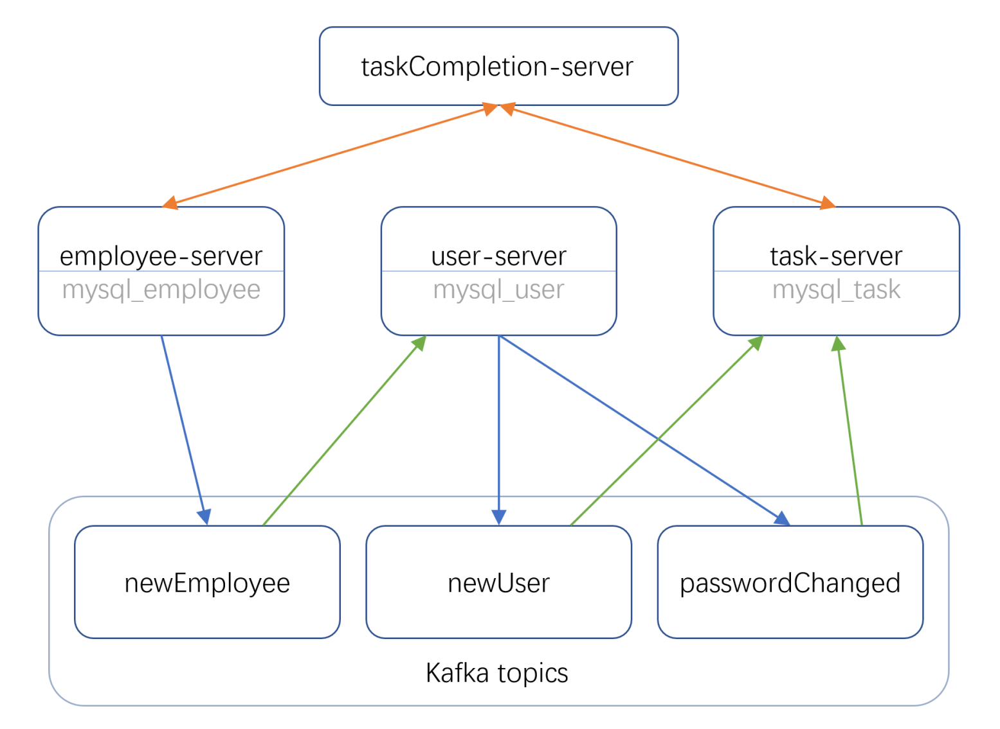

## 1. 小组成员

### 张超 21210240419

## 2. 项目结构

## 3. 项目运行

启动之前需要先打包好各个服务，电脑需要安装 maven：
~~~
mvn clean package
~~~
启动项目：
~~~
docker-compose build
docker-compose up -d
~~~
停止项目：
~~~
docker-compose down
~~~

## 4. 测试

要使用 testREST.txt 文件进行测试，需要安装 vscode 插件 REST Client。

或者用 postman 测试。

## 5. 场景 3 实现方法

        关键的服务是 taskCompletion-server，其中开放了一个 REST 接口 “getTaskCompletions” 用来获取结果。
        方法会先同步调用 employee-server 的 employees 接口来获取所有员工的列表 List，然后对每个员工，根据 id 工号调用 task-server 的 getTasksByUseridAndCategory 接口来获取每个员工的任务完成情况（其中 category 为任务种类，冗余设计，方便后续增加其他不同任务，此任务中恒为 1）。然后使用两个 HashMap 来统计每个部门的总员工数量和完成的员工数量，最后返回结果。
        因为此功能是同步调用，调用时才进行统计，所以员工更换部门后获取的结果仍然正确。